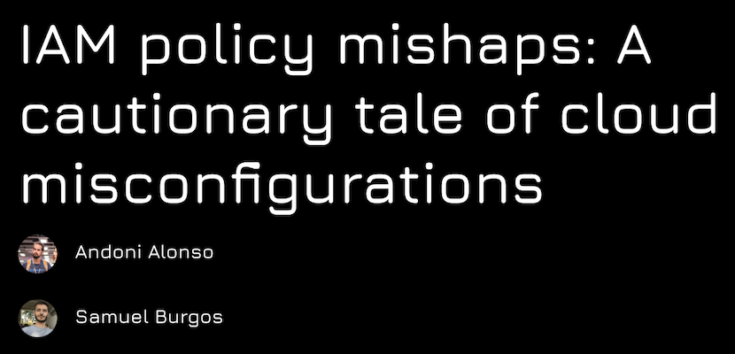

# IAM Mishaps Demo
> We're all familiar with the principle of least privilege, but... how easy is it to apply in the cloud? We'll walk you through several AWS IAM case studies, demonstrating just how complex achieving it can be and what the consequences might be.

Originally created for [Sh3llcon 2024 talk](https://sh3llcon.es/programa/):
<br>

Updated for [AWS UG VLC Meetup](https://www.meetup.com/aws-valencia/events/303501987) with a new case.


# Cases

## Resources

To check the resources that are goint to be created for each case check the `USAGE.md` file under `docs/` folder.

## Requirements

- An AWS Account: to deploy demo resources you will need an AWS account
  > All resources are included in the free tier if you don't abouse the requests

- Each case stores the tfstate in a S3 bucket to allow, to create that tfstates bucket deploy it using:
  ```bash
  cd bootstrap/
  make plan
  make apply
  ```

## Deploy it

- [Case 1 - S3](./case1_s3/README.md)

- [Case 2 - SNS](./case2_sns/README.md)

- [Case 3 - Chatbot](./case3_chatbot/README.md)

## Blog IAM Series
- [IAM policy mishaps: Intro to IAM](https://unicrons.cloud/en/2024/02/20/iam-policy-mishaps-intro-to-iam/)
- [IAM policy mishaps: Case 1 - S3](https://unicrons.cloud/en/2024/06/01/iam-policy-mishaps-case-1---s3/)
- More soon...
